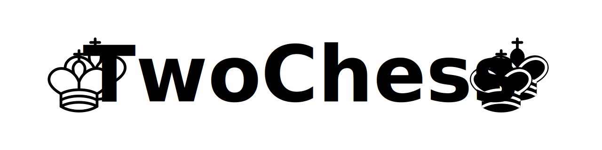

# TwoChess



TwoChess is a Python-based chess application that allows for 2 vs 2 matches.
This repository contains the source code for the application.

## Installation

TwoChess currently depends on the ``tkinter`` library. The easiest way to
install it is using conda

```bash
conda install tk
```

and then execute the script using Python

```bash
python3 twochess.py
```

## About

TwoChess is a unique take on the classic game of chess, allowing for 2vs2 matches. This application is written in Python and is currently in its pre-version stage. Contributions and suggestions are welcome!

## License

This project is licensed under the MIT License. See the LICENSE file for more details.

## Contributing

If you're interested in contributing to the development of TwoChess, please feel free to fork the repository, make your changes, and submit a pull request. We appreciate any and all contributions!
